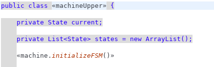

# TP IDM Metamodel - M1 ICE
### Pericat Etienne et Kaïs Ben-Youssef

## Usage
#### Retrieving working project
1) Clone the repo in your/a new workspace.

2) Run gemoc and go to **File &rarr; Open projects from file system &rarr; Directory &rarr; choose the cloned directory** .

3) **m1ice.idm.lab1** and open **model/lab1.genmodel** &rarr; right click on Lab1 &rarr; **Generate All**.

4) Go to **m1ice.idm.lab2/src/m1ice.idm/** and right click on **GenerateLab2.mwe2** &rarr; Run as &rarr; Mwe2 Workflow.

5) **Important : **When importing project from a git repository there is some build path issues: If it is missing, right click on m1ice.idm.lab1 and add a new folder &rarr; src (the build path should update automatically). Also add **src** and **xtend-gen** folder in m1ice.idm.lab2.ui.tests **or every folder that appear missing in the "problems" section.**. **Rerun step4 after that**.

6) Go tu **Run** &rarr; **Run Configuration** &rarr; Right click on **Eclipse application**. Make sure Gemoc is selected in Main &rarr; Run a product. And that "all workspace ..." is selected in **Plugins section**.

#### Run a test
Here you are with your new instance of Gemoc that is running the generated plugin.

To test the plugin :
- **Create** a new Java project.
- Add a file with **.q** extension.
- You can use the stateMachine language in this file.

An example of file would be :
~~~~
stateMachine MetaModeledStateMachine
	state closed init
	state opened

	transition OFF opened -> down
	transition ON closed -> opened

	state down
	transition stop closed -> down
	transition stop opened -> down
~~~~
You can add transition or states, or rename every components.

- When saving '.q' file generated classes are placed into **src-gen** folder.
- Put them into **src/..** (m1ice.Xtend.lab package or edit file to new package).

You can now run the main in "MetaModeledStateMachine.java (or the file corresponding to what you wrote)" and write your transition into the console and see that the stateMachine is acting as you defined it into the .q file.

## Sample files
Sample files (model and generated) can be found in **sample** folder.

# Build a VM for your StateMachine DSL
## What has been change from the previous version
The only way I found to launch the code specified in "Aspects" classes is to call an init method inside of my constructor (see next Figure):  

See other changes in **m1ice.idm.lab2/src/.../generator/Lab2Generator.xtend**

With it, when you save the ".q" file, as we saw in the last part, the system is launched. It basically does the same things than the "main" generated inside the StateMachine file, except that the concept is not the same. Here the code is executed directly and is not visible by the user.

**When you save you should see something like this : **

The remaining problem is that when you launch the VM, the console on the
second launched eclipse doesn't respond (at least on mine). But you can at least enter transition names an see that **it's working when you enter it on gemoc**.

### The project named idm.compiler.exectest can be used to run ".q" file after you run the new eclipse Configuration from Gemoc.
